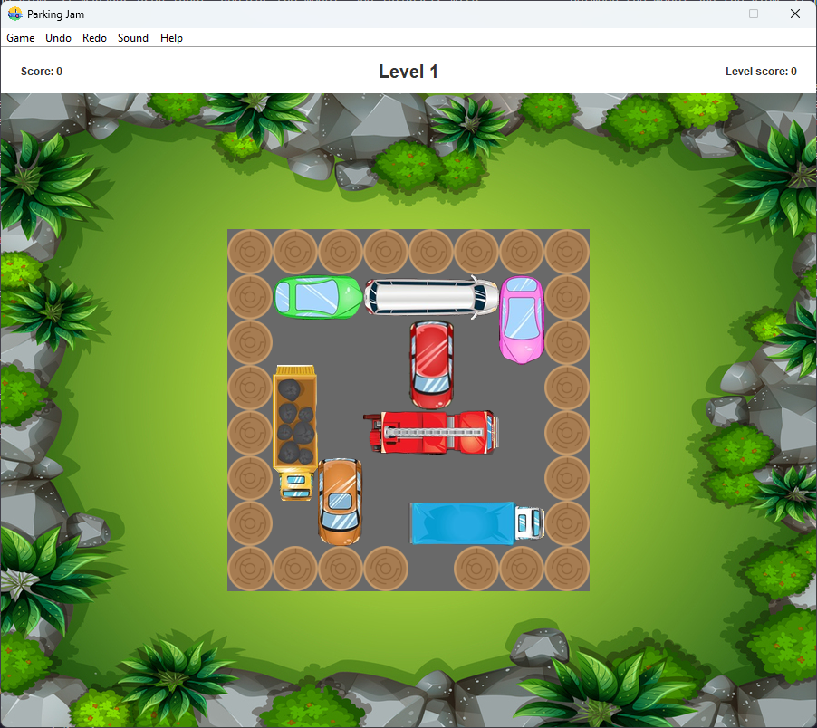

# **Parking-Jam** #

This repository contains a Java project to play the game called **parking-jam**. Parking-jam is a game were the goal is to make the red car get out of the parking lot. To do so, you have to move the rest of the cars horizontally or vertically as long as there is nothing with which it can collide (cars or walls). Play and try to pass the different levels.

## Table of Contents ##

* [Introduction](#introduction)
  * [Download the source code](#download-the-source-code)
  * [Run tests](#run-tests)
  * [Directory Layout](#directory-layout)
  * [Implementation](#implementation)
* [Run the game](#run-the-game)
  * [How to play](#how-to-play)
  * [Load and save](#load-and-save)
* [Authors](#authors)

## Introduction ##

### Download the source code ###

1. [Install Java](<http://www.oracle.com/java/technologies/downloads/>)
2. [Install Maven](<https://maven.apache.org/download.cgi>)
3. Clone the git repository `https://costa.ls.fi.upm.es/gitlab/200320/parking-jam.git`

### Run tests ###

1. Change to the root directory of the repository
2. Create the project build `mvn clean install`
3. Run the tests with `mvn test`

### Directory Layout ###
``` terminal
    parking-jam
    ├── README.md
    ├── deliverables
    │   ├── backlog1.csv
    │   ├── backlog2.csv
    │   └── sprint1.csv
    ├── pom.xml
    └── src
        ├── main
        │   ├── java
        │   │   └── es
        │   │       └── upm
        │   │           └── pproject
        │   │               └── parkingjam
        │   │                   ├── App.java
        │   │                   ├── common
        │   │                   │   ├── Coordinates.java
        │   │                   │   └── Pair.java
        │   │                   ├── controller
        │   │                   │   └── Controller.java
        │   │                   ├── exceptions
        │   │                   │   ├── LevelNotFoundException.java
        │   │                   │   └── WrongLevelFormatException.java
        │   │                   ├── interfaces
        │   │                   │   ├── IController.java
        │   │                   │   └── Resetable.java
        │   │                   ├── models
        │   │                   │   ├── Car.java
        │   │                   │   ├── Game.java
        │   │                   │   ├── Level.java
        │   │                   │   └── Parking.java
        │   │                   └── view
        │   │                       ├── MainFrame.java
        │   │                       ├── panels
        │   │                       │   ├── CarPanel.java
        │   │                       │   ├── ImagePanel.java
        │   │                       │   └── ParkingPanel.java
        │   │                       └── utils
        │   │                           ├── Constants.java
        │   │                           └── MusicPlayer.java
        │   └── resources
        │       ├── data
        │       │   ├── board.txt
        │       │   └── score.txt
        │       ├── img
        │       │   ├── backgrounds
        │       │   │   └── background.png
        │       │   ├── carIcon.png
        │       │   ├── cars
        │       │   │   ├── car1.png
        │       │   │   ├── car10.png
        │       │   │   ├── car11.png
        │       │   │   ├── car2.png
        │       │   │   ├── car3.png
        │       │   │   ├── car4.png
        │       │   │   ├── car5.png
        │       │   │   ├── car6.png
        │       │   │   ├── car7.png
        │       │   │   ├── car8.png
        │       │   │   ├── car9.png
        │       │   │   └── redcar.png
        │       │   ├── congrats.png
        │       │   └── wall
        │       │       └── wall.png
        │       ├── levels
        │       │   ├── level_1.txt
        │       │   ├── level_2.txt
        │       │   └── level_3.txt
        │       ├── levels4GameTest
        │       │   ├── level_1.txt
        │       │   └── level_2.txt
        │       ├── levels4LevelTest
        │       │   ├── levelTest1.txt
        │       │   ├── levelTest2.txt
        │       │   ├── levelTest3.txt
        │       │   ├── levelTest4.txt
        │       │   ├── levelTest5.txt
        │       │   ├── levelTest6.txt
        │       │   ├── levelTest7.txt
        │       │   └── levelTest8.txt
        │       ├── log4j.properties
        │       ├── saveloadLevelTest
        │       │   └── test3.txt
        │       └── sounds
        │           ├── background.wav
        │           ├── default.wav
        │           ├── game_completed.wav
        │           ├── level_completed.wav
        │           ├── move_car.wav
        │           ├── new_game.wav
        │           ├── reset.wav
        │           └── undo.wav
        └── test
            └── java
                └── es
                    └── upm
                        └── pproject
                            └── parkingjam
                                ├── common
                                │   ├── CoordinatesTest.java
                                │   └── PairTest.java
                                └── models
                                    ├── CarTest.java
                                    ├── GameTest.java
                                    └── LevelTest.java
```

### Implementation ###

This project is oriented to emulate the game **parking-jam** using the **model-view-controller** arquitecture pattern.

**Controller** is the class that handless the communication between the model and the view. Is in charge of starting the game, handling the user input and updating the model.

**model** is formed by four classes. The first one is *car.java* that represents a car with all the characteristics. For example length, id, orientation... Another one is *level.java* is the class that represents a level in which we have the board, create the cars, verify if a movement is valid, reset the level and level up. Furthermore, *game.java* represents the game and is in charge of managing the different levels, create a new game, manage the score, and more. And last but not least, *parking.java* is the class that is representing the board.

**mainframe** is the class in charge of controlling the gui.

**level** is represented by a matrix of characters. The character '+' represents a wall, '*' a red car, '@' is the goal and the rest of letters are cars.

## Run the game ##

1. Change to the root directory of the repository
2. Compile the project with: `mvn clean compile`
3. Run the game with: `mvn exec:java`

<div style="text-align: center;">

  

</div>

### How to play ###

The objective of the game is to move the cars in order the red car can scape the parking lot. The cars can only be moved horizontally or vertically without colliding with other cars or walls. In order to move the cars you have to click the car you want to move and drag it.

### Load and save ###

The game can be saved and loaded from a file. The file is a txt file that contains the state of the game when it was saved. In this file you will find the positions of the cars, the level score, the global score and the stack of the moves

## Authors ##

200315 - Nihel Kella Bouziane

200320 - Julio Manso Sánchez-Tornero

200034 - Lucía Sánchez Navidad

200358 - Álvaro Dominguez Martín